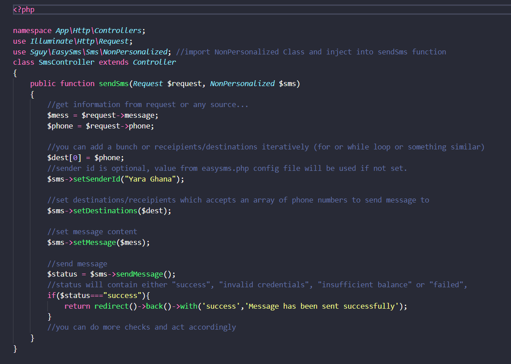

<h3>Description</h3>

EasySms is a laravel package which basically a wrapper for smsonlinegh.com sms gateway which makes it very easy to send sms in your laravel aoolications with little setup.
 
This package also comes with a notification channel that integrates very well with laravel's powerful notification system.
<b>You may however note that smsonlinegh works only in ghana!.</b>

# This package is available via composer, follow the steps below to complete installation.

<ol style="font-weight: lighter; ">
    <li>Run <b>composer require sguy/easysms</b></li>
    <li >Add <b><i>Sguy\EasySms\EasySmsServiceProvider::class,</i></b> to the providers array in app.php config file</li>
    <li>Publish Config File by Running the following command <b><i>php artisan vendor:publish --tag=easysms</i></b></li>
    <li>Run <b><i>composer dump-autoload</i></b></li>
</ol>

<h3>Usage<h3>
 This package allows you to send sms,schedule sms, check sms balance, check the charge per sms before sending and finally using it as a channel for your notifications
  
<h4>Step One</h4>
To begin using this package, you need to create an account on https://smsonlinegh.com for free.
You may want to buy some credits on your account to send sms (credits are very affordable).
After creating your account and buying some sms credits, navigate to the <b>easysms.php</b> config file and update accordingly.

# easysms.php Config File
The config file has just three keys ..
<ol style="font-weight: lighter;">
  <li><b>account_login :</b> add the username or email of the account you created on smsonlinegh as value for this key.</li>
   <li><b>account_password :</b> add the password for the account you created on smsonlinegh as value for this key.</li>
  <li><b>sender_id :</b> this is basically whom you want to send the message as, it should not be more than 11 chars else value will be trimed and firt 11 used
    eg. sender id can be an organization name,<b> Yara Ghana</b> or a phone number, 0543920099 .</li>
  
</ol>
  
  <h3>Step 2<h3>
  
  # Sending simple message
  
  

  # Scheduling sms
  
  

  # Checking balance and charge per sms
  
  
  
   # Notification Channel
  
  

  # Testing
